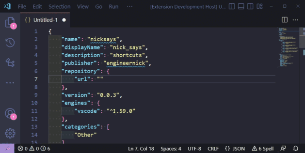
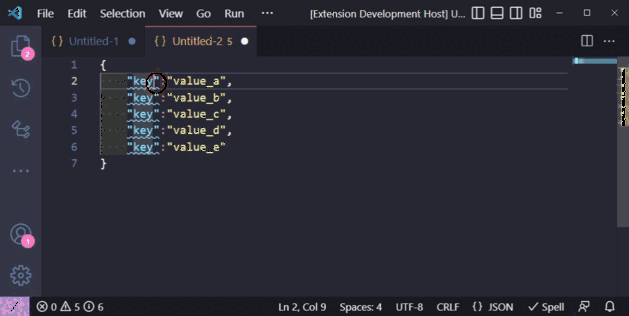

# Multi-Cursor-Align <!-- omit in toc -->

> Formally called "nick_says".

- [1. Command: `Left Align`](#1-command-left-align)
- [2. Command: `Right Align`](#2-command-right-align)
- [3. Command: `Number Cursors from Zero` and `Number Cursors from One`](#3-command-number-cursors-from-zero-and-number-cursors-from-one)
- [4. Command: `Seek to Next Occurrence`](#4-command-seek-to-next-occurrence)
- [5. Command: `Expand to Next Occurrence`](#5-command-expand-to-next-occurrence)

## 1. Command: `Left Align`

## 2. Command: `Right Align`

1. Open a vscode text editor or jupyter notebook text cell
2. Place multiple selections or multiple cursors (eg by using by using `Alt+Left Click` or `Ctrl+Alt+Up/Down Arrow` or other methods)
3. Press `Ctrl+Shift+P` to open the command search
4. Search for:
   - `Align Left Selections by Adding Spaces` OR
   - `Align Right Selections by Adding Spaces`
5. Spaces will be added before each cursor such that all cursors are now vertically aligned
   - Note: Weird stuff happens if there are two cursors on the same line, but it doesn't break anything; You can use Ctrl+Z to undo.

## 3. Command: `Number Cursors from Zero` and `Number Cursors from One`

1. Open a vscode text editor or jupyter notebook text cell
2. place multiple selections or multiple cursors (eg by using by using `Alt+Left Click` or `Ctrl+Alt+Up/Down Arrow` or other methods)
3. Press `Ctrl+Shift+P` to open the command search
4. Search for
   - `Number Cursors from Zero` OR
   - `Number Cursors from One`
5. Numbers will be inserted at each cursor
   - starting at `0` or `1` respectively
   - *ordered in the same way that cursors were created*

## 4. Command: `Seek to Next Occurrence`

Prompts for a search string, then moves current selection(s) forwards to the next occurrence, staying on the same line as the current selection(s) end.

*TODO: screencapture*

## 5. Command: `Expand to Next Occurrence`

Prompts for a search string, then expands current selection(s) forwards to before the next occurrence of the search string, staying on the same line as the current selection(s) end.

*TODO: screencapture*